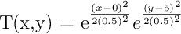

# libField

`libField` is a C++14 library with a simple, clean interface for storing,
accessing, and manipulating fields (i.e. data with coordinates).
Its primary objective is to make writing programs that work with field data (such as
finite-difference based physics simulations) quick and simple.

Consider writing a 3-dimensional finite-difference heat solver. `libField` makes it simple
to create an array for the temperature and setup a coordinate system.

```
#include <libField/Field.hpp>

int main()
{
  // create a 100x100x200 array to store the temperature over the domain x = [-5,5], y = [-5,5], z = [0,20].
  Field<double,3> T(100,100,200);
  T.setCoordinateSystem( Uniform(-5,5), Uniform(-5,5), Uniform(0,20) );

  // set initial temperature distribution to T(x,y,z) = x*y*z
  for(int i = 0; i < T.size(0); i++)
  {
    for(int j = 0; j < T.size(1); j++)
    {
      for(int k = 0; k < T.size(2); k++)
      {
        auto x = T.getCoord(i,j,k);
        T(i,j,k) = x[0]*x[1]*x[2];
      }
    }
  }
        
  // do work and profit

  
  return 0;
}

```

The `Field` class is a small class that uses the boost `multi_array` class to store data and contains a coordinate
system. `multi_array` is used because of its support for array slicing, which allows `libField` to provide
support for field slicing.

# Motivation

Physics simulations often require you to work with large arrays of data that correspond to some physical quantity
that is defined at multiple points in space (i.e. a field). For example, a finite-difference heat solver would
create an initial temperature distribution and then "update" this distribution as it stepped forward in time.
The finite-difference time-domain method for electrodynamics operates on an array of data for the electric and
magnetic fields.

Since these algorithms are used for a physics simulation, they depend on the coordinate system. For example,
calculating the derivative of a field in the x direction using a finite difference approximation requires knowledge
of the spacing between consecutive field elements in the x direction.

`libField` aims to provide a simple, clean API for creating, storing, accessing, and manipulating field data that
would be used to write physics simulations, and this simple API is stressed above all else. Currently, minimal
effort has been made to make it “fast". The code tries to be efficient and fast, but no great effort has been
made to optimize it... yet. `libField` is in the early stages of development, and once the API stabilizes,
and has a full test harness, the underlying implementation can be optimized.

# Tutorial

## Installing

To use `libField`, you just need to include `libField/Field.hpp` in your program. Note that `libField` depends on
`boost`, but only the header library. Specifically, `libField/Field.hpp` will include `boost/array.hpp`, `boost/multi_array.hpp`, `boost/optional.hpp`, and 'boost/assert.hpp'.


```C++
#include <libField/Field.hpp>
```

So `libField/` just needs to be in your include path. There are multiple ways to achieve this.

### Add to your CMake configuration using `add_subdirectory`.

You can add the `libField` project directory as a sub-directory in your `CMakeLists.txt`
```CMake
...
# add the libField project
add_subdirectory(libField)
# define your target that depends on libField
# for example...
add_executable( myApp main.cpp )
# link your target to libField
target_link_libraries( myApp libField::Field )
...

```

`libField` requires C++14. Linking against the `libField::Field` target will automatically add this requirement.

### Install `libField`

You can install `libField` with CMake. This will install a `libFieldConfig.cmake` file that CMake will use to detect and configure `libField`.

```Bash
$ cd libField
$ mkdir build
$ cd build
$ cmake ..
$ cmake --build .
$ cmake --build . --target install
```

Now you can find `libField` in your `CMakeLists.txt` file using the `find_package` command and link
against the `libField::Field` target.
```CMake
...
# find libField
find_package(libField)
# define your target that depends on libField
# for example...
add_executable( myApp main.cpp )
# link your target to libField
target_link_libraries( myApp libField::Field )
...

```

### Manual/Old School

If you are not using `cmake`, then you need to start. If you are still just writing your simulations in a single file (called `main.cpp` or `myProg.cpp` for example),
then you can just copy this directory to your project directory and compile using `gcc`

```C++
> gcc -IlibField/src/ -std=c++14 main.cpp -o myProg
```

## Creating a Field

The main class provided by `libField` is the `Field` class. This is basically a
multi-dimensional array with a coordinate system attached. The class takes two
template arguments: the type used to store data, and the number of
dimensions in the field. For example, to create a two-dimensional field that
stores `double`s with 11 elements in the x direction and 15 elements in the y
direction you would just pass the dimension sizes to the constructor.

```C++
Field<double,2> T(11,15);
```

This will automatically allocate memory for both the field data, and the coordinate system. However, we still
need to initialize the coordinate system axes. This is done with the `setCoordinateSystem()` method of the
`Field` class. We usually want to discretize the coordinate axes in some regular fashion. For example, we may
want to discretize the x axis uniformly from -3 to 3, and the y axis uniformly from 0 to 10. `libField` provides
helper functions to take care of these common cases.

```C++
  T.setCoordinateSystem( Uniform(-3.,3.), Uniform(0.,10.) );
```

(Note: by using 11 for the size in the x direction, x = 0 will be included in the axis (at index 5))
We will probably want to initialize the field data. Typically, we would want to start off with zero. This
can be done with the `set()` method.

```C++
  T.set( 0.0 );
```

## Accessing Field Data

`libField` provides simple interface for accessing field data and coordinate
values. For example, let's say you wanted to initialize the two-dimensional
temperature field a circular Gaussian temperature distribution centered at
(0,5), with a standard deviation of 0.5.  So, what we want to do is create a
discretized version of this field:



To do this, we need to loop through the elements in the field, determine the coordinates for each
element, and compute the value of the element based on these coordinates. Elements in the field are
accessed with the `operator()()` method, which takes the element indices. The `Field` class also provides
a method named `getCoord()` that takes the element indices as well and returns an array of the coordinate values.
So, initializing the field to a Gaussian distribution could be accomplished like this
(Note: you will need to import the `cmath` header to use `exp()`):

```C++
for(int i = 0; i < T.size(0); i++)
{
  for(int j = 0; j < T.size(1); j++)
  {
    auto x = T.getCoord(i,j); // this returns a 2-element array with the x and y coordinates
    T(i,j) = exp( 2*x[0]*x[0]) * exp(2*(x[1]-5)*(x[1]-5))
  }
}
```

And that is the basic interface provided by the Field class. Other methods exist for accessing the
underlying `CoordinateSystem` class and getting raw pointers to the data stored in the field (and coordinate system), but these would only be needed in exceptional cases.

## Slicing

One of the nice features provided by the `Field` class is the ability to slice it. Slicing a field
returns a field view than can be used to access a subset the field data (and coordinates) as if they were their
own field object. For example, it is possible to create a one-dimensional field that contains temperature values
along the line x = -3.
```C++
auto T2 = T.slice( indices[5][IRange()] );
// now T2(0) == T(5,0)
```
Here the `ranges` object is provided by the boost `multi_array` library. It is used to specify index ranges for
the slicing operation. `IRange` is an alias defined by `libField`. It is the same as `boost::multi_array_types::index_range`, and is used to define the index range for a single dimension.

It is possible to specify sub-ranges, i.e. ranges that do not extend over the entire field.

```C++
auto T3 = T.slice( indices[5][IRange(2,8)] );
// note that the right side of range is *exclusive* [2,8) = [2,7]
// now T3(0) == T(5,2)
// and T3(T3.size()-1) == T(5,7)
```

It is even possible to specify strided ranges, so that consecutive elements in the field view will not
be consecutive elements in the original field.

```C++
auto T4 = T.slice( indices[IRange(0,7,2)][1] );
// now
// T4(0) == T(0,1)
// T4(1) == T(2,1)
// T4(2) == T(4,1)
// T4(3) == T(6,1)
```

## Writing Field Data to a File

Once you have ran a simulation to compute the values of field, you will often need to save this data. The `Field` class supports
the `operator<<`, which will write the field to plain text in a gnuplot-compatible format.

```C++
Field<double,1> T(10);
T.setCoordinateSystem(Uniform(0,2));
T.set_f( [](auto x){ return x[0]*x[0]; };

ostream out("Tvst.txt")
out << T
out.close();
```

Fields can also be written to HDF5 format, but you must link against the HDF5 C++ library. To write a field
to HDF5, include `libField/HDF5.hpp` and call `hdf5write(...)`.

```C++
#include<libField/Field.hpp>
#include<libField/HDF5.hpp>
...
Field<double,1> T(10);
T.setCoordinateSystem(Uniform(0,2));
T.set_f( [](auto x){ return x[0]*x[0]; };

hdf5write("Tvst.h5", T);

```

Fields can also be *read* from HDF5, which makes storing a field for use later very simple
```C++
#include<libField/Field.hpp>
#include<libField/HDF5.hpp>
...
Field<double,2> T(10,20);
T.setCoordinateSystem(Uniform(0,2), Uniform(0,4));
T.set_f( [](auto x){ return x[0]*x[0] + x[1]*x[1]; };

// save field to disk
hdf5write("Tvst.h5", T);

...

// load saved into another field
// note that the data types do not have to match.
// HDF5 will take care of the conversion.
Field<double,2> T2;
hdf5read("Tvst.h5", T2);

```

Functions for reading and writing to specific paths in file are also provided.

```C++
#include<libField/Field.hpp>
#include<libField/HDF5.hpp>
...
Field<double,2> T(10,20);
T.setCoordinateSystem(Uniform(0,2), Uniform(0,4));
T.set_f( [](auto x){ return x[0]*x[0] + x[1]*x[1]; };

// save field to disk
hdf5write("Tvst.h5", "/path/to/group", T);

...

// load saved into another field
// note that the data types do not have to match.
// HDF5 will take care of the conversion.
Field<double,2> T2;
hdf5read("Tvst.h5", "/path/to/group", T2);

```
